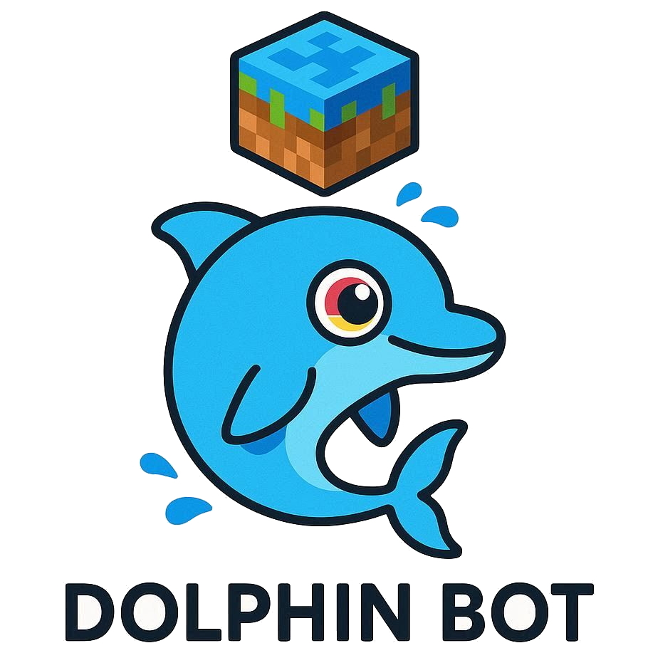

# DolphinMinecraftBot-Reloaded
<p align="center">
   
</p>
   <div align="center">
   ✨ A lightweight, reliable, intelligent MC bot for general minecraft server, with high-scalability and performance. It integrated plugin loaders like bukkit and easy-used interface styled APIs, allows you to customize event handles. ✨
   </div>
<p align="center">
  <a href="https://github.com/NeonAngelThreads/DolphinBot/releases">
    
  </a>
   <br>
   <a href="https://github.com/NeonAngelThreads/DolphinBot/commits/master/">
      
   </a>
  
  <a href="https://github.com/NeonAngelThreads/DolphinBot/issues">
    
  </a>
  <a href="https://github.com/NeonAngelThreads/DolphinBot/tree/master/src/main">
     
  </a>
  <p align="center">
     <a href="https://github.com/NeonAngelThreads/DolphinBot/blob/master/PluginDocs.md">📖Docs</a>
     ·
     <a href="https://github.com/NeonAngelThreads/DolphinBot/issues">🐛Submit Suggestion/Bug</a>
  </p>
</p>

## Why DolphinBot?
   - **High performance**, DolphinBot allows you to start multiple bot instances at one client with low CPU usage.   
   - **High reliability**, ability to bypass 2b2t's human verification, auto-reconnect when disconnected, long term running with no worries for losing connection.  
   - **High extensibility**, DolphinBot embedded mature DolphinAPI that contains variety of `packet listeners`, `event systems` and easy-used `event handlers` based on `mc protocol lib`,
     It integrates a bukkit-like plugin API, allowing you to develop custom plugins at very short time.  
   - **Advanced logging system**, DolphinAPI also implemented `TextComponent` serializer to parse rich colors and styles for server messages, with more useful information.
   - **Easy to use**, directly run, you can put the bot profile(s) into config file instead of defining on command-line, fast start.
### **Shortcuts**: [Custom plugin developing guideline](PluginDocs.md)
## Features:
   - Easy to register custom commands starting with `!` by using CommandBuilder DolphinAPIs
   - Bypassing human verification in most servers including `2b2t.xin`.
   - Supporting to configure the bot clusters, and start at once.
   - Supporting colourful console logging strings expression `colorizeText("&6Hello &lWorld")`.
   - Automatic answer questions in `2b2t.xin` for speeding up login process.
   - Supporting to reload a plugin while the client is running on server.
## Introduction:
   **Features category:**  
   - [`Hot-Reloading Plugin`](#hot-swapping-plugins-in-game)

   **Implemented Event APIs:**
   - [`Command Systems`](PluginDocs.md#2-commands-system)
   - [`Packet Handlers`](PluginDocs.md#3-deep-understand-dolphinapis-)  
   - [`Player Events`](PluginDocs.md#player-events)
   - [`Force Unicode Chat`](PluginDocs.md#unicode-string-helper)

   Command-line Arguments
## Getting Started
In this section, you will understand below how-tos:  
  - **1. How to directly start a single bot with command-line.**  
  - **2. How to specify bot profile with config file without command-line.**  
  - **3. How to start multiple bot simultaneously**  
  - **4. How to configure advanced options**  
  - **5. How to make a custom plugin**  

1. **Download the Client**  
   Download the jar archive file: `DolphinBot-[version]-full.jar`.  
   Requirements: **Java version >= 17**
2. **Configuration of the Bot**  
**Configuring Profile**  
   There are two different ways to set bot config:
   - If you want to quickly start for simplicity and only one bot started, you can use **Command-line setting**  
   - If you would like to start multiple bot at once, and access advanced options, you can use **Config file setting**    

   1. **Command-line Setting**  
        In-game profile should be defined on below boot command-line.  
        An example of argument list:
        ```bash
        java -jar "DolphinBot-[version].jar" -username=[username] -password=[password] -skin-recorder=[enable/disable]
        ```
      `--username` : in-game displaying name of bot.  
      `--password` : password for login or register.  
      `--auto-reconnect` : whether reconnect to server when got kicked or disconnect by some reasons.  
      `--skin-recorder` : whether automatic capture and save online players' skins.
         
      **Warning:**  command-line has high authority than config file, meaning that if options are duplicated, will only recognize 
      command-line, and ignore config file one.  
      Optionally, you can specify more option by adding argument:  
      `--owner` : Specifying only who can use this bot.
   2. **Config File Setting**  
         Config files include functional config `mc.bot.config.json` and profile config `bot.profiles.json`  
         You can also move above profile arguments into config file ``bot.profiles.json`` following below formats, all config values in it will be loaded.
         DolphinBot will apply command-line options first, duplicated options in config file will be ignored.    
         To specify the path of config file is optional, Use option `-config-file` to locate config directory or file.  
         For example:  
         ```bash 
         java -jar "DolphinBot-[version].jar" -config-file=path/to/config.json
         ```
         If the path you specified is a directory instead of a file, Dolphin will extract config file as default config in this directory.  
         ```bash
         java -jar "DolphinBot-[version].jar" -config-file=path/to/config_directory
         ```
         If the `--config-file` parameter is absented, DolphinBot will create a default file on jar directory.  
         ```bash 
         java -jar "DolphinBot-[version].jar"
         ```
         
         In the profile config file, you can create `profiles` key in `bot.profiles.json` to specify multiple bot profiles to log to a server.  
         **Warning**: Defining multiple bots may trigger the anti-bot or anti-cheat, and some servers with strict policy may prohibit it.
         ```json
         {
            "profiles": {
               "bot#1": {
                  "name": "Player494",
                  "password": "123example",
                  "owner": "player_name",
         
                  "enabled_plugins": [
                     "QuestionAnswerer",
                     "MessageDisplay",
                     "HumanVerify"
                  ]
               },
               "bot#2": {
                  "name": "Player495",  
                  "password": "password",
                  "owner": "player_name",
         
                  "enabled_plugins": [
                     "HumanVerify"
                  ]
               },
               "bot#3": {"...": "..."}
            }
         }
         ```
         where `enabled_plugins` key represents which plugins should enable on the bot.
         In this case, if you want to load `bot#1` as your single bot, you should add below argument:  
         ```bash
         java -jar "DolphinBot-[version].jar" -config-file=path/to/config_directory -profiles="bot#1"
         ```  
         or
         ```bash
         java -jar "DolphinBot-[version].jar" -profiles="bot#1"
         ```   
         If you want to start multiple bot simultaneously, specify multiple profile name as a list in option `-profiles`, for
         each profile name, should be split with ";".  
         **Examples:**  
         ```bash
         java -jar "DolphinBot-[version].jar" -profiles="bot#1;bot#2"
         ```  
         ```bash
         java -jar "DolphinBot-[version].jar" -profiles="bot#1;bot#2;bot#3;..."
         ```
         - **Warning**: If the `--profiles` option is absented, it will load all bots in profile config by default.
   2. **Advanced Configurations (optional)**  
      If you want to access more advanced configs, you can edit `mc.bot.config.json`.  
      Every single config option is equilibrium to option that defined by command line, and all config value including
      unrecognized option will be parsed, so you can add your customize config options.  
      An example for configuring this file:
      ```json
       {
          "server": "2b2t.xin",
          "port": 25565,
          "auto-reconnecting": true,
   
          "packet-filter-delay": 3000,
          "max-chunk-view": 12,
   
          "connect-timing-out": 2000,
          "reconnect-delay": 3000
      }
      ```   
      Config Options:
   
      | Config                | Description                                                                |
      |-----------------------|----------------------------------------------------------------------------|
      | `server`              | For defining server address.                                               |
      | `port`                | For defining server port.                                                  |
      | `auto-reconnecting`   | Whether reconnect to server when got kicked or disconnect by some reasons. |
      | `packet-filter-delay` | Max receiving delay(millis) between every target packet.                   |
      | `max-chunk-view`      | Max scale of chunk packet receiving.                                       |
      | `connect-timing-out`  | How long millis does it take to determine a connection time out.           |
      | `reconnect-delay`     | Min delay(millis) for cooling down when reconnect a server.                |
## Hot Swapping Plugins In-Game
Dolphin bot supports you to hot-reload plugins in server, without quit the entire client and reconnecting to server.
You can send `!reload <pluginName>` dolphin command in server chat.
Console controlling are still in-developing, currently. 